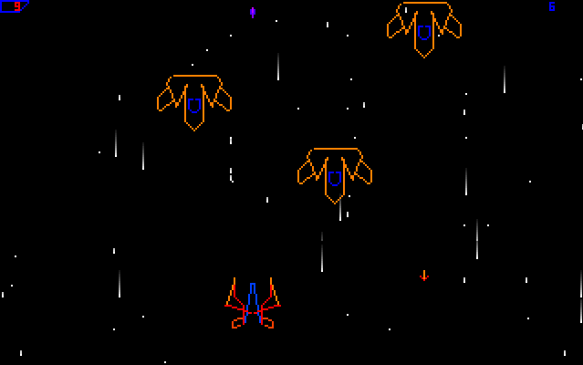

# Fly Shooter

A simple self-booting arcade game for 8086 CPU based PC machine.
It boots from either a floppy or a HDD and only requires BIOS.



## Controls

Motion: `A`, `S`, `W` and `D`.
Shooting: `Space`.

## Building

Requires FASM.

```bash
make
```

## Running

Practically, an emulator should be used.
For instance, Qemu:

```bash
qemu-system-i386 -fda boot.bin
```
